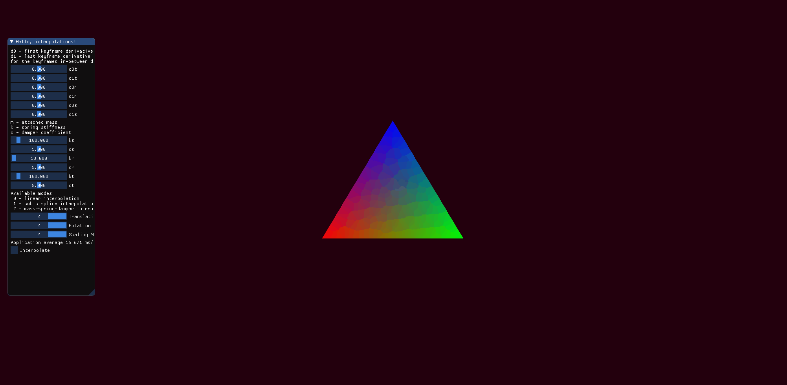

# Keyframe-Interpolation
 
**TODO:**

   ~~keep window aspect ratio~~  
   ~~add keyframes~~  
   ~~add interpolated transform getter~~  
   ~~add interpolation funcs:~~  
   
   - ~~linear~~
   - ~~spline~~
   - ~~spring-like~~

   ~~fix lack of continuity (currently not considering momentum when doing spring interps)~~  

## Damped Mass-Spring Interpolation

## Current Version

Base code taken from the GLFW Documentation
